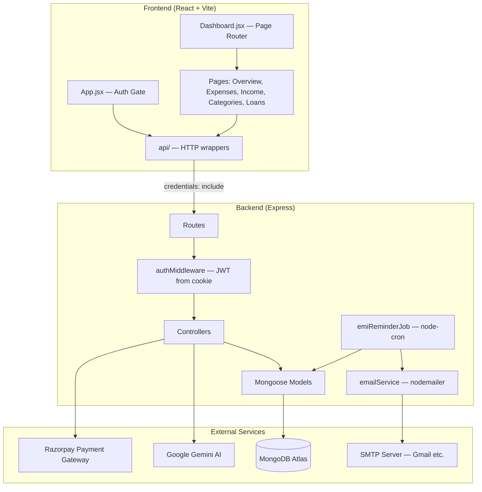
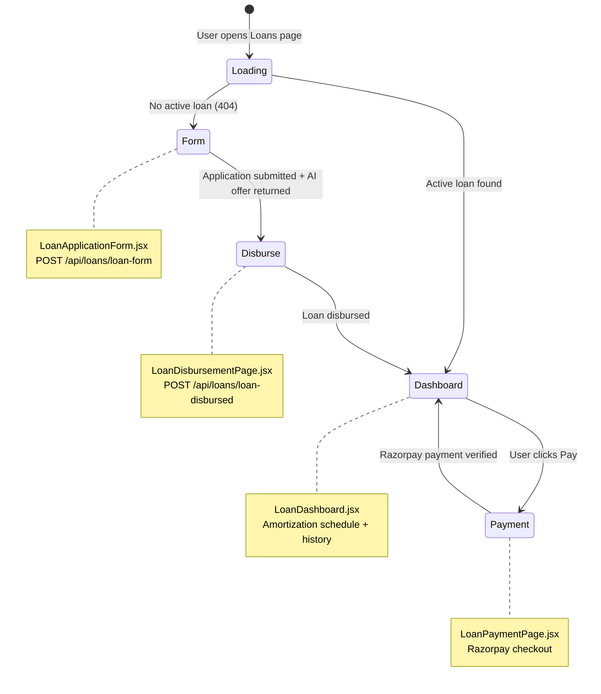
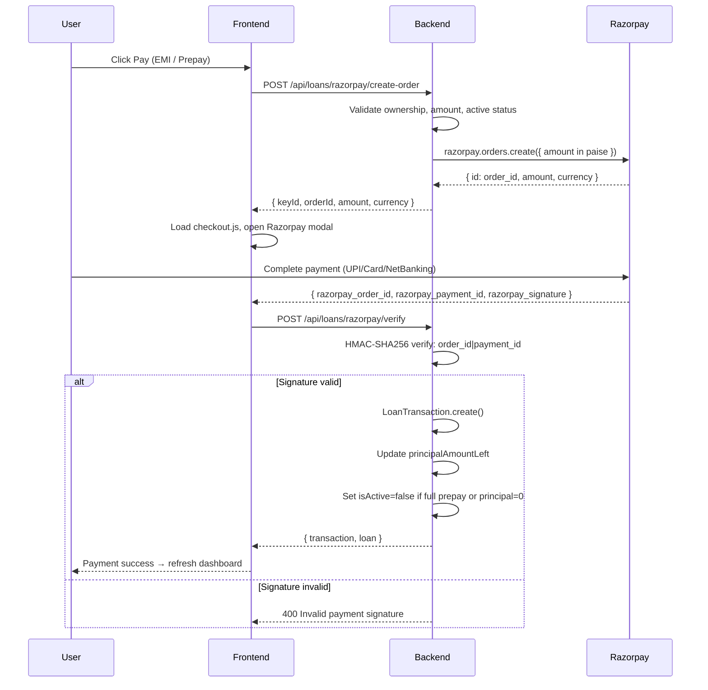
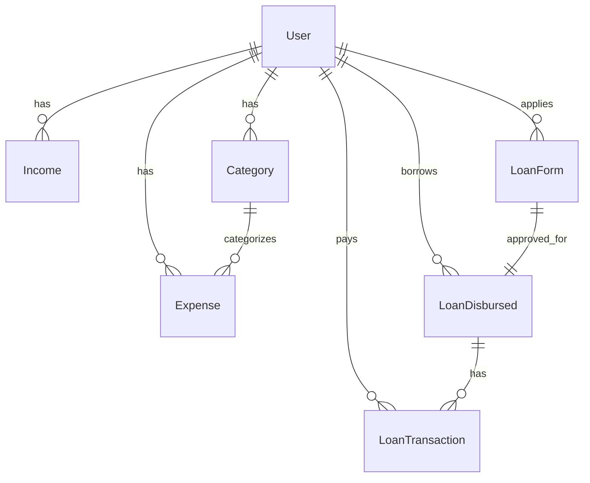

# FinTrack — Personal Finance & Loan Management Platform

FinTrack is a full-stack fintech application that combines **personal finance tracking** (income, expenses, categories, analytics) with a complete **personal loan lifecycle** — from AI-powered loan application and approval, through disbursement and EMI repayment via Razorpay, to automated email reminders before due dates.

The project is structured as a monorepo with a **React + Vite frontend** and a **Node.js + Express + MongoDB backend**.

---

## Table of Contents

1. [Features Overview](#features-overview)
2. [Tech Stack](#tech-stack)
3. [Project Structure](#project-structure)
4. [Architecture](#architecture)
5. [Getting Started](#getting-started)
6. [Environment Variables](#environment-variables)
7. [Authentication Flow](#authentication-flow)
8. [Personal Finance Module](#personal-finance-module)
9. [Loan Module — End-to-End Flow](#loan-module--end-to-end-flow)
10. [EMI Calculation Logic](#emi-calculation-logic)
11. [Razorpay Payment Integration](#razorpay-payment-integration)
12. [EMI Reminder Cron Job](#emi-reminder-cron-job)
13. [API Reference](#api-reference)
14. [Database Models](#database-models)
15. [Frontend Navigation & Pages](#frontend-navigation--pages)
16. [Validation Rules](#validation-rules)
17. [Testing the Cron Job](#testing-the-cron-job)
18. [Known Limitations & Future Improvements](#known-limitations--future-improvements)

---

## Features Overview

| Module | Features |
|--------|----------|
| **Authentication** | Register, login, JWT in httpOnly cookie, session restore on page reload |
| **Expenses** | Create, read, update, delete expenses with category and payment method |
| **Income** | Track income sources with optional remarks |
| **Categories** | Budget categories with spending limits |
| **Analytics** | Monthly overview — income, expenses, savings rate, category breakdowns, budget tracking |
| **Loans** | Application form, AI risk scoring (Gemini), disbursement, amortization schedule, Razorpay payments |
| **EMI Reminders** | Daily cron job sends email 2 days before EMI due date |
| **Settings** | Placeholder (coming soon) |

---

## Tech Stack

### Backend

| Technology | Purpose |
|------------|---------|
| Node.js + Express 5 | REST API server |
| MongoDB + Mongoose 9 | Database & ODM |
| JWT + bcryptjs | Authentication & password hashing |
| Joi | Request validation |
| cookie-parser + CORS | httpOnly cookie auth with credentials |
| Razorpay SDK | Payment gateway |
| Google Gemini AI (`@google/genai`) | Loan risk scoring |
| node-cron | Scheduled EMI reminder job |
| nodemailer | Email delivery for reminders |
| dotenv | Environment configuration |

### Frontend

| Technology | Purpose |
|------------|---------|
| React 19 | UI framework |
| Vite 8 | Build tool & dev server |
| Plain CSS | Styling (no UI library) |
| Fetch API | HTTP client with `credentials: 'include'` |
| Razorpay Checkout.js | Client-side payment modal |

**Intentionally not used:** React Router, Redux, Tailwind, or a component library — navigation is state-based for simplicity.

---

## Project Structure

```
fintech-app/
├── README.md                          ← This file
├── INTERVIEW_QUESTIONS.md             ← Interview Q&A for this project
│
├── backend/
│   ├── index.js                       ← Express entry point, MongoDB connect, cron start
│   ├── package.json
│   ├── .env                           ← Environment variables (not committed)
│   │
│   ├── controllers/                   ← Business logic per resource
│   │   ├── authController.js
│   │   ├── categoryController.js
│   │   ├── expenseController.js
│   │   ├── incomeController.js
│   │   ├── loanFormController.js      ← Loan application + Gemini AI scoring
│   │   ├── loanDisbursedController.js
│   │   ├── loanTransactionController.js
│   │   └── loanPaymentController.js   ← Razorpay order + verify
│   │
│   ├── middlewares/
│   │   └── authMiddleware.js          ← JWT verification from cookie
│   │
│   ├── models/                        ← Mongoose schemas
│   │   ├── User.js
│   │   ├── Category.js
│   │   ├── Expense.js
│   │   ├── Income.js
│   │   ├── LoanForm.js
│   │   ├── LoanDisbursed.js
│   │   └── LoanTransaction.js
│   │
│   ├── routes/                        ← Express route definitions
│   │   ├── authRoutes.js
│   │   ├── categoryRoutes.js
│   │   ├── expenseRoutes.js
│   │   ├── incomeRoutes.js
│   │   ├── loanFormRoutes.js
│   │   ├── loanDisbursedRoutes.js
│   │   ├── loanTransactionRoutes.js
│   │   └── loanPaymentRoutes.js
│   │
│   ├── utils/
│   │   └── loanCalculations.js        ← EMI math (mirrors frontend)
│   │
│   ├── services/
│   │   └── emailService.js            ← Nodemailer for EMI reminders
│   │
│   ├── jobs/
│   │   └── emiReminderJob.js          ← Daily cron scheduler
│   │
│   └── scripts/
│       └── testEmiReminder.js         ← Manual test runner for cron
│
└── frontend/
    ├── index.html
    ├── vite.config.js
    ├── package.json
    │
    ├── public/
    │   ├── favicon.svg
    │   └── icons.svg
    │
    └── src/
        ├── main.jsx                   ← React root
        ├── App.jsx                    ← Auth gate + session restore
        │
        ├── api/                       ← Backend API wrappers
        │   ├── config.js              ← API_URL = http://localhost:3000
        │   ├── http.js                ← fetch helpers (credentials: include)
        │   ├── auth.js
        │   ├── categories.js
        │   ├── dashboard.js
        │   ├── expenses.js
        │   ├── incomes.js
        │   └── loans.js
        │
        ├── components/
        │   ├── LoginForm.jsx
        │   ├── RegisterForm.jsx
        │   └── layout/
        │       ├── DashboardLayout.jsx
        │       └── Sidebar.jsx
        │
        ├── pages/
        │   ├── AuthPage.jsx
        │   ├── Dashboard.jsx          ← Page router (state-based)
        │   ├── AnalyticsOverview.jsx
        │   ├── ExpensesPage.jsx
        │   ├── IncomePage.jsx
        │   ├── CategoriesPage.jsx
        │   ├── PlaceholderPage.jsx
        │   └── loans/
        │       ├── LoansPage.jsx      ← Loan flow state machine
        │       ├── LoanApplicationForm.jsx
        │       ├── LoanDisbursementPage.jsx
        │       ├── LoanDashboard.jsx
        │       ├── LoanPaymentPage.jsx
        │       └── LoansPage.css
        │
        └── utils/
            ├── analytics.js           ← Monthly filtering, breakdowns
            ├── validation.js            ← Auth validation
            ├── expenseValidation.js
            ├── incomeValidation.js
            ├── categoryValidation.js
            ├── loanValidation.js
            ├── loanCalculations.js      ← EMI/schedule (mirrors backend)
            └── razorpay.js              ← Razorpay SDK loader + checkout
```

---

## Architecture



### Request Flow (Authenticated API Call)

```
Browser
  │
  │  fetch(url, { credentials: 'include' })
  │  → Cookie: token=<JWT> sent automatically
  ▼
Express (index.js)
  │
  ▼
Route (e.g. /api/expenses/user-expenses)
  │
  ▼
authMiddleware
  │  reads req.cookies.token
  │  jwt.verify(token, JWT_SECRET)
  │  sets req.user = { userId, name }
  ▼
Controller
  │  uses req.user.userId to scope data
  ▼
Mongoose Model → MongoDB
  │
  ▼
JSON Response → Frontend
```

---

## Getting Started

### Prerequisites

- **Node.js** v18 or higher
- **MongoDB** — local instance or [MongoDB Atlas](https://www.mongodb.com/atlas) cluster
- **Google Gemini API key** — for loan risk scoring
- **Razorpay test keys** — for payment testing ([Razorpay Dashboard](https://dashboard.razorpay.com))
- **SMTP credentials** — optional, for EMI reminder emails (Gmail app password works)

### 1. Clone and install

```bash
# Backend
cd fintech-app/backend
npm install

# Frontend
cd ../frontend
npm install
```

### 2. Configure environment

Create `backend/.env` (see [Environment Variables](#environment-variables) section for full list):

```env
PORT=3000
MONGODB_URI=mongodb+srv://<user>:<pass>@cluster.mongodb.net/fintechdb
JWT_SECRET=your-secret-key
SALTS=13
GEMINI_API_KEY=your-gemini-api-key
RAZORPAY_KEY_ID=rzp_test_xxxxx
RAZORPAY_KEY_SECRET=your-razorpay-secret
SMTP_HOST=smtp.gmail.com
SMTP_PORT=587
SMTP_USER=your@gmail.com
SMTP_PASS=your-app-password
EMAIL_FROM="FinTrack <your@gmail.com>"
EMI_REMINDER_ENABLED=true
```

Ensure `frontend/src/api/config.js` points to your backend:

```js
export const API_URL = 'http://localhost:3000'
```

### 3. Run the application

**Terminal 1 — Backend:**

```bash
cd fintech-app/backend
npx nodemon index.js
```

Expected output:
```
MongoDB connected
[emiReminderJob] Scheduled daily at "0 9 * * *" (Asia/Kolkata)
Server running on port 3000
```

**Terminal 2 — Frontend:**

```bash
cd fintech-app/frontend
npm run dev
```

Open the URL shown by Vite (typically `http://localhost:5173`).

### 4. Production build (frontend)

```bash
cd fintech-app/frontend
npm run build
npm run preview
```

---

## Environment Variables

| Variable | Required | Default | Description |
|----------|----------|---------|-------------|
| `PORT` | No | `3000` | Express server port |
| `MONGODB_URI` | **Yes** | — | MongoDB connection string |
| `JWT_SECRET` | **Yes** | — | Secret for signing/verifying JWT tokens |
| `SALTS` | **Yes** | — | bcrypt salt rounds (integer, e.g. `13`) |
| `NODE_ENV` | No | — | Set to `production` for secure cookies |
| `GEMINI_API_KEY` | For loans | — | Google Gemini API key for risk scoring |
| `GOOGLE_API_KEY` | Alt | — | Alternative env name for Gemini key |
| `RAZORPAY_KEY_ID` | For payments | — | Razorpay public/test key |
| `RAZORPAY_KEY_SECRET` | For payments | — | Razorpay secret for orders + HMAC verify |
| `SMTP_HOST` | For reminders | — | SMTP server hostname |
| `SMTP_PORT` | No | `587` | SMTP port (`465` for SSL) |
| `SMTP_USER` | For reminders | — | SMTP username |
| `SMTP_PASS` | For reminders | — | SMTP password or app password |
| `EMAIL_FROM` | No | `SMTP_USER` | Sender address for reminder emails |
| `EMI_REMINDER_CRON` | No | `0 9 * * *` | Cron expression (9 AM daily IST) |
| `EMI_REMINDER_ENABLED` | No | `true` | Set `false` to disable cron job |

---

## Authentication Flow

FinTrack uses **JWT stored in an httpOnly cookie** — not localStorage. This reduces XSS risk because JavaScript cannot read the token.

```mermaid
sequenceDiagram
    participant U as User (Browser)
    participant F as Frontend
    participant B as Backend
    participant DB as MongoDB

    Note over U,DB: Registration
    U->>F: Fill register form
    F->>B: POST /api/auth/register { name, email, password }
    B->>B: Joi validate + bcrypt.hash(password)
    B->>DB: User.create()
    B-->>F: 201 { success: true }

    Note over U,DB: Login
    U->>F: Fill login form
    F->>B: POST /api/auth/login { email, password }
    B->>DB: User.findOne({ email })
    B->>B: bcrypt.compare(password, hash)
    B->>B: jwt.sign({ userId, name }, JWT_SECRET, { expiresIn: '1d' })
    B-->>F: Set-Cookie: token=<JWT>; httpOnly; sameSite=lax; maxAge=24h
    F-->>U: Redirect to Dashboard

    Note over U,DB: Session Restore (page reload)
    F->>B: GET /api/auth/me (cookie sent automatically)
    B->>B: authMiddleware → jwt.verify
    B-->>F: { user: { id, name } }
    F-->>U: Show Dashboard

    Note over U,DB: Protected Request
    F->>B: GET /api/expenses/user-expenses (credentials: include)
    B->>B: authMiddleware verifies cookie JWT
    B->>DB: Expense.find({ userId: req.user.userId })
    B-->>F: Expense list
```

### Password Requirements

Both frontend and backend enforce:
- Minimum 8 characters
- At least one uppercase letter
- At least one lowercase letter
- At least one digit
- At least one special character

Regex: `/^(?=.*[A-Z])(?=.*[a-z])(?=.*\d)(?=.*[^A-Za-z0-9]).{8,}$/`

### Cookie Configuration

```js
res.cookie("token", token, {
  httpOnly: true,                              // Not accessible via document.cookie
  secure: process.env.NODE_ENV === "production", // HTTPS only in production
  maxAge: 24 * 60 * 60 * 1000,                 // 1 day
  sameSite: "lax"                              // CSRF mitigation
})
```

### CORS

Backend allows origins `http://localhost:5173` and `http://localhost:5174` with `credentials: true`, so cookies are sent cross-origin during development.

---

## Personal Finance Module

### Expenses

Users record spending with:
- **Title** (3–100 characters)
- **Amount** (≥ 0)
- **Category** (linked to Category model)
- **Payment method** — UPI, Cash, Credit Card, Debit Card, NetBanking

API: full CRUD under `/api/expenses`. Expenses are scoped to the authenticated user via `userId`.

### Income

Users track income sources with:
- **Source** (required string)
- **Amount** (≥ 0)
- **Remark** (optional, max 200 characters)

API: full CRUD under `/api/incomes`.

### Categories

Budget categories with:
- **Category name** (3–50 characters)
- **Category budget** (≥ 0)

Categories are created per user. The frontend filters categories by `userId`; note that the backend `GET /api/categories/get-categories` returns all categories globally (frontend handles filtering).

### Analytics Overview

The Overview page (`AnalyticsOverview.jsx`) computes client-side analytics from fetched income and expense data:

- **Monthly income total**
- **Monthly expense total**
- **Net savings** (income − expenses)
- **Savings rate** (savings / income × 100)
- **Expense breakdown by category** (pie/bar data)
- **Income breakdown by source**
- **Expense breakdown by payment method**
- **Category budget tracking** — spent vs. budget per category
- **Recent transactions** list
- **Month selector** — navigate previous/next months

All analytics logic lives in `frontend/src/utils/analytics.js`.

---

## Loan Module — End-to-End Flow

The loan module is the most complex part of FinTrack. It spans application, AI underwriting, disbursement, repayment, and automated reminders.



### Step 1: Loan Application

**Page:** `LoanApplicationForm.jsx`  
**API:** `POST /api/loans/loan-form`

The user submits:
| Field | Description |
|-------|-------------|
| applicantName | Full name |
| applicantEmail | Contact email (used for EMI reminders) |
| applicantAddress | Residential address |
| applicantPhone | Phone number |
| panNumber | PAN card number |
| creditScore | Self-reported CIBIL-style score (300–900) |
| loanPurpose | Reason for the loan |
| kycDocument | KYC document URL or reference |

**Backend processing (`loanFormController.js`):**

1. Validates input with Joi
2. Checks user has **no existing active loan** (`LoanDisbursed.findOne({ userId, isActive: true })`)
3. Creates `LoanForm` document
4. Fetches user's **Income** and **Expense** records from the finance module
5. Computes aggregates:
   - Total monthly income
   - Total monthly expenses
   - Monthly surplus (income − expenses)
   - Expense-to-income ratio
6. Sends all data to **Google Gemini AI** (`gemini-flash-latest`) with a structured prompt
7. AI returns a **risk score** (0.00–1.00):
   - Higher = riskier, less creditworthy
   - Lower = safer, more creditworthy
8. Computes loan offer:
   - **Loan amount** = `5,000,000 × riskScore` (up to ₹50 lakh)
   - **Interest rate** by risk band:

| Risk Score | Interest Rate (p.a.) |
|------------|---------------------|
| ≥ 0.90 | 25% |
| 0.70 – 0.89 | 21% |
| 0.50 – 0.69 | 18% |
| 0.30 – 0.49 | 15% |
| 0.10 – 0.29 | 12% |
| < 0.10 | 10% |

**Response:** `{ loanForm, loanAmount, interestRate }`

### Step 2: Loan Disbursement

**Page:** `LoanDisbursementPage.jsx`  
**API:** `POST /api/loans/loan-disbursed`

After receiving the AI offer, the user chooses:
- **Disbursement amount** — slider from ₹50,000 to approved maximum (step ₹10,000)
- **Tenure** — 6 to 48 months

The frontend calculates EMI live using `calculateEMI()` as the user adjusts sliders.

**Submitted payload:**
```json
{
  "loanFormId": "<ObjectId>",
  "disbursedAmount": 500000,
  "disbursedInterest": 15.00,
  "disbursedDuration": 24,
  "emiAmount": 24200,
  "principalAmountLeft": 500000,
  "isActive": true
}
```

Backend creates `LoanDisbursed` record. **One active loan per user** is enforced.

### Step 3: Loan Dashboard

**Page:** `LoanDashboard.jsx`  
**APIs:**
- `GET /api/loans/get-loan` — active loan for current user
- `GET /api/loans/loan-form/:id` — applicant details
- `GET /api/loans/loan-transactions/:loanDisbursedId` — payment history

The dashboard shows:
- Loan summary (amount, interest, tenure, EMI, principal remaining)
- **Repayment progress bar** (% of principal repaid)
- **Amortization schedule** — month-by-month breakdown with due dates
- **Payment history** — all Razorpay transactions
- Paid EMIs marked on the schedule via `applyTransactionsToSchedule()`

### Step 4: Loan Payment (Razorpay)

**Page:** `LoanPaymentPage.jsx`

Three payment modes:

| Mode | Amount | Description |
|------|--------|-------------|
| **EMI** | Fixed `emiAmount` | Regular monthly installment |
| **Partial Prepayment** | Custom (min ₹1,000, < principal) | Reduces outstanding principal |
| **Full Prepayment** | Entire `principalAmountLeft` | Closes the loan |

See [Razorpay Payment Integration](#razorpay-payment-integration) for the full payment flow.

### Business Rules

- **One active loan per user** — enforced at application and disbursement
- **Loan closes** when `principalAmountLeft` reaches 0 or user does Full Prepayment
- **EMI due dates** are computed at runtime, not stored in DB
- **Paid EMI count** = number of `LoanTransaction` records with `transactionType === 'EMI'`

---

## EMI Calculation Logic

EMI calculation uses the standard **reducing balance method** employed by most Indian lenders.

### Formula

```
monthlyRate = annualInterestRate / 12 / 100

EMI = P × r × (1 + r)^n / ((1 + r)^n - 1)

Where:
  P = principal (loan amount)
  r = monthlyRate
  n = tenure in months
```

**Zero-interest edge case:** `EMI = round(principal / tenureMonths)`

Result is rounded to the nearest integer (₹).

### Amortization Schedule

`generateRepaymentSchedule(principal, annualRate, tenureMonths, startDate)` builds a month-by-month table:

For each month `1..n`:
1. `interest = round(balance × monthlyRate)`
2. `principalPart = min(emi - interest, balance)`
3. `balance = max(0, balance - principalPart)`
4. `dueDate = disbursedDate + month` (using `setMonth`)

Each row contains: `{ month, dueDate, emi, principal, interest, balance, status }`

### Transaction Overlay

`applyTransactionsToSchedule(schedule, transactions)` marks schedule rows based on payment history:
- **EMI** → marks next pending row as `paid`
- **Partial Prepayment** → marks first pending row as `partial-prepay`
- **Full Prepayment** → marks all pending rows as `closed`

### Shared Logic

The same calculation logic exists in:
- `frontend/src/utils/loanCalculations.js` — for UI display
- `backend/utils/loanCalculations.js` — for cron job due date computation

Both files are intentionally mirrored to keep frontend and backend in sync.

---

## Razorpay Payment Integration

FinTrack uses the **server-side order + signature verification** pattern recommended by Razorpay.



### Security Measures

1. **Server creates the order** — amount is set server-side, not trusted from client
2. **Ownership validation** — `loan.userId === req.user.userId`
3. **Amount validation** — cannot exceed `principalAmountLeft`
4. **HMAC signature verification** — prevents fake payment callbacks:
   ```js
   const body = `${razorpay_order_id}|${razorpay_payment_id}`
   const expectedSignature = crypto
     .createHmac('sha256', RAZORPAY_KEY_SECRET)
     .update(body)
     .digest('hex')
   ```
5. **Active loan check** — cannot pay on closed loans

### Frontend Razorpay Helper

`frontend/src/utils/razorpay.js`:
- Dynamically loads `checkout.js` (only once)
- Opens Razorpay modal with server-created order
- On success, calls verify API with payment IDs and signature
- Handles payment cancellation and failure

---

## EMI Reminder Cron Job

A daily cron job sends email reminders to borrowers whose next EMI is due in **exactly 2 days**.

### Files

| File | Purpose |
|------|---------|
| `backend/jobs/emiReminderJob.js` | Cron scheduler + reminder logic |
| `backend/services/emailService.js` | Nodemailer transporter + HTML email template |
| `backend/utils/loanCalculations.js` | Due date computation |
| `backend/scripts/testEmiReminder.js` | Manual test/dry-run script |

### Schedule

- **Default:** `0 9 * * *` — every day at 9:00 AM IST
- **Override:** `EMI_REMINDER_CRON` env var
- **Disable:** `EMI_REMINDER_ENABLED=false`
- **Started in:** `backend/index.js` after MongoDB connects

### Algorithm

```
Daily at 9 AM IST:

1. Find all LoanDisbursed where isActive = true
2. For each loan:
   a. Skip if principalAmountLeft <= 0
   b. Count paid EMIs from LoanTransaction (type = 'EMI')
   c. Compute next EMI due date from disbursedDate + month offset
   d. Skip if due date is NOT exactly 2 calendar days from today (IST)
   e. Skip if lastEmiReminderDueDate already matches this due date (dedup)
   f. Send HTML email to applicantEmail (fallback: User.email)
   g. Save lastEmiReminderDueDate on the loan document
3. Log sent/skipped counts
```

### Email Content

The reminder email includes:
- Borrower name
- EMI number (e.g. "3 of 24")
- Amount due (formatted in INR)
- Due date (formatted in IST)
- Friendly reminder that payment is due in 2 days

### Duplicate Prevention

The `lastEmiReminderDueDate` field on `LoanDisbursed` prevents sending the same reminder twice if the server restarts or the job is triggered manually on the same day.

---

## API Reference

**Base URL:** `http://localhost:3000`

All routes except login and register require authentication (JWT cookie).

### Auth — `/api/auth`

| Method | Path | Auth | Description |
|--------|------|------|-------------|
| POST | `/register` | No | Create user account |
| POST | `/login` | No | Authenticate, set JWT cookie |
| GET | `/me` | Yes | Get current user from JWT |

### Expenses — `/api/expenses`

| Method | Path | Description |
|--------|------|-------------|
| GET | `/user-expenses` | All expenses for authenticated user |
| GET | `/get-expense-by-category/:categoryId` | Expenses filtered by category |
| POST | `/create-expense` | Create new expense |
| PUT | `/update-expense/:id` | Update expense |
| DELETE | `/delete-expense/:id` | Delete expense |

### Incomes — `/api/incomes`

| Method | Path | Description |
|--------|------|-------------|
| GET | `/user-incomes` | All incomes for authenticated user |
| GET | `/get-income-by-id/:id` | Single income by ID |
| POST | `/create-income` | Create new income |
| PUT | `/update-income/:id` | Update income |
| DELETE | `/delete-income/:id` | Delete income |

### Categories — `/api/categories`

| Method | Path | Description |
|--------|------|-------------|
| GET | `/get-categories` | All categories |
| POST | `/create-category` | Create category |
| PUT | `/update-category/:id` | Update category |
| DELETE | `/delete-category/:id` | Delete category |

### Loans — `/api/loans`

| Method | Path | Description |
|--------|------|-------------|
| POST | `/loan-form` | Submit loan application → AI scoring |
| GET | `/loan-form/:id` | Get loan application by ID |
| GET | `/get-loan` | Get active loan for current user |
| GET | `/loan-disbursed/:id` | Get disbursed loan by ID |
| POST | `/loan-disbursed` | Disburse loan with EMI details |
| GET | `/loan-transactions/:loanDisbursedId` | Payment history for a loan |
| POST | `/loan-transaction` | Record transaction (legacy/direct) |
| POST | `/razorpay/create-order` | Create Razorpay payment order |
| POST | `/razorpay/verify` | Verify payment + record transaction |

---

## Database Models

All models use Mongoose `{ timestamps: true }` → automatic `createdAt` and `updatedAt`.

### User

| Field | Type | Notes |
|-------|------|-------|
| name | String | required |
| email | String | required, unique |
| password | String | required (bcrypt hash) |

### Category

| Field | Type | Notes |
|-------|------|-------|
| userId | ObjectId → User | required |
| categoryName | String | required, 3–50 chars |
| categoryBudget | Number | required, min 0 |

### Expense

| Field | Type | Notes |
|-------|------|-------|
| userId | ObjectId → User | required |
| amount | Number | required, min 0 |
| categoryId | ObjectId → Category | required |
| title | String | required, 3–100 chars |
| paymentMethod | String | enum: UPI, Cash, Credit Card, Debit Card, NetBanking |

### Income

| Field | Type | Notes |
|-------|------|-------|
| userId | ObjectId → User | required |
| amount | Number | required, min 0 |
| source | String | required |
| remark | String | optional, max 200 chars |

### LoanForm

| Field | Type | Notes |
|-------|------|-------|
| userId | ObjectId → User | required |
| applicantName | String | required |
| applicantEmail | String | required |
| applicantAddress | String | required |
| applicantPhone | String | required |
| loanPurpose | String | required |
| creditScore | Number | required |
| kycDocument | String | required |
| panNumber | String | required |

### LoanDisbursed

| Field | Type | Notes |
|-------|------|-------|
| loanFormId | ObjectId → LoanForm | required |
| userId | ObjectId → User | required |
| disbursedAmount | Number | required |
| disbursedDate | Date | default: now |
| isActive | Boolean | default: true |
| disbursedInterest | Number | required (% p.a.) |
| disbursedDuration | Number | required (months) |
| emiAmount | Number | required |
| principalAmountLeft | Number | required |
| lastEmiReminderDueDate | Date | default: null (cron dedup) |

### LoanTransaction

| Field | Type | Notes |
|-------|------|-------|
| loanDisbursedId | ObjectId → LoanDisbursed | required |
| userId | ObjectId → User | required |
| transactionAmount | Number | required |
| transactionDate | Date | default: now |
| transactionType | String | enum: EMI, Partial Prepayment, Full Prepayment |
| razorpayPaymentId | String | required |

### Entity Relationships



---

## Frontend Navigation & Pages

FinTrack does **not** use React Router. Navigation is managed via React state.

### App Level (`App.jsx`)

```
isCheckingSession → Loading spinner
isAuthenticated   → Dashboard
else              → AuthPage (login/register toggle)
```

### Dashboard Level (`Dashboard.jsx`)

| Page ID | Component | Description |
|---------|-----------|-------------|
| `overview` | AnalyticsOverview | Monthly financial analytics |
| `expenses` | ExpensesPage | Expense CRUD + search/filter |
| `income` | IncomePage | Income CRUD |
| `categories` | CategoriesPage | Category CRUD + budget |
| `loans` | LoansPage | Full loan lifecycle |
| `settings` | PlaceholderPage | Coming soon |

Sidebar navigation is in `components/layout/Sidebar.jsx`.

### Loan Sub-Views (`LoansPage.jsx`)

| View | Component | Trigger |
|------|-----------|---------|
| `loading` | Spinner | Initial load |
| `form` | LoanApplicationForm | No active loan |
| `disburse` | LoanDisbursementPage | Application approved |
| `dashboard` | LoanDashboard | Loan disbursed |
| `payment` | LoanPaymentPage | User clicks Pay |

---

## Validation Rules

### Backend (Joi in controllers)

All API endpoints validate request bodies with Joi schemas before processing.

### Frontend Validation Files

| File | Validates |
|------|-----------|
| `validation.js` | Auth — email format, password strength, name length |
| `expenseValidation.js` | Title 3–100 chars, amount ≥ 0, category required, payment method |
| `incomeValidation.js` | Source required, amount ≥ 0, remark ≤ 200 chars |
| `categoryValidation.js` | Name 3–50 chars, budget ≥ 0 |
| `loanValidation.js` | PAN format, phone format, credit score 300–900, prepay min ₹1,000 |

---

## Testing the Cron Job

A dedicated test script is provided at `backend/scripts/testEmiReminder.js`.

```bash
cd fintech-app/backend

# Dry run — see which loans qualify (no emails sent)
node scripts/testEmiReminder.js

# Send emails for loans due in exactly 2 days (real cron logic)
node scripts/testEmiReminder.js --send

# Send for EMIs due today (easier to test with existing data)
node scripts/testEmiReminder.js --send --days 0

# Force send to first active loan (ignores due date — good for SMTP testing)
node scripts/testEmiReminder.js --send --force
```

---

## Known Limitations & Future Improvements

| Area | Current State | Suggested Improvement |
|------|--------------|----------------------|
| Logout | Client-side only (clears React state) | Add server-side logout endpoint that clears cookie |
| Categories API | Returns all users' categories | Scope backend query by `userId` |
| Resource ownership | Update/delete don't verify `userId` | Add ownership checks in controllers |
| Loan rejection | All applications get an offer | Add minimum risk threshold for rejection |
| EMI schedule storage | Computed at runtime | Store schedule in DB for audit trail |
| Shared EMI logic | Duplicated in frontend/backend | Extract to shared npm package |
| Token refresh | JWT expires after 1 day | Implement refresh token rotation |
| File upload | KYC is a URL string | Add actual file upload (S3/Cloudinary) |
| Settings page | Placeholder | Profile edit, password change, notification prefs |
| Tests | No automated tests | Add Jest/Vitest unit + integration tests |

---

## License

This project is for educational and portfolio purposes.
